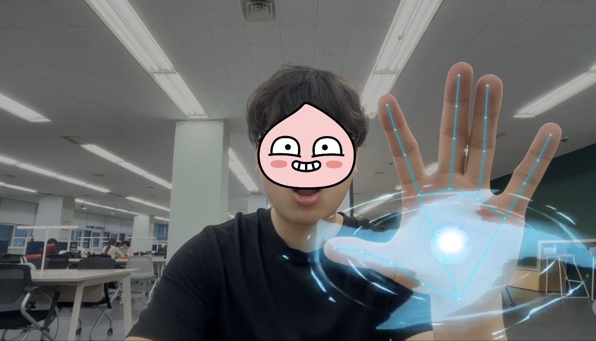
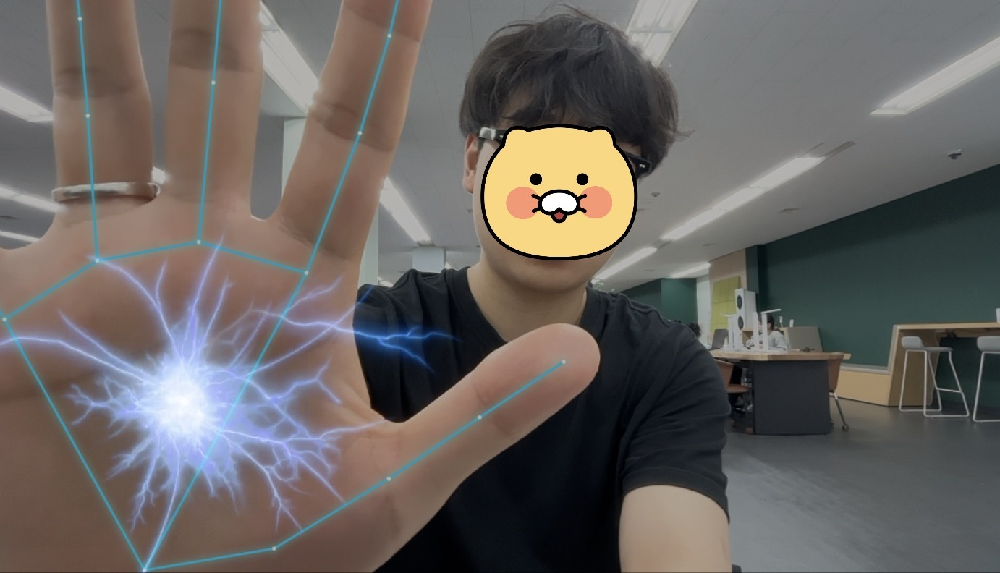

# Naruto Hand

웹캠으로 손을 인식하고, 손을 펼치면 Naruto/Sasuke 스타일의 이펙트를 보여주는 간단한 브라우저 데모입니다.

- 기본 언어: 한국어
- English version: [English](#english)
- 예시 화면: [맨 아래에서 보기](#예시-화면--preview)

---

## 한국어

### 소개

`naruto-hand`는 브라우저에서 실행되는 정적 웹 프로젝트입니다. 웹캠을 켜고 **MediaPipe Hands**로 손 랜드마크를 감지한 뒤, 손을 펼치면 화면 위에 애니메이션 효과를 띄웁니다.

- 왼손: Naruto 효과
- 오른손: Sasuke 효과
- 별도 빌드 과정 없음
- `index.html`을 로컬 서버로 실행하면 바로 확인 가능

### 프로젝트 구조

```text
.
├── index.html          # 웹캠 + 손 추적 데모 메인 파일
├── assets/
│   ├── naruto.mp4      # 왼손 효과 영상
│   └── sasuke.mp4      # 오른손 효과 영상
├── 1.jpg               # 예시 이미지
└── 2.jpg               # 예시 이미지
```

### 실행 방법

```bash
git clone https://github.com/jubin0615/naruto-hand.git
cd naruto-hand
```

**VS Code Live Server**로 실행하세요:

1. VS Code Extensions에서 `Live Server`를 검색합니다.
2. **Ritwick Dey**가 만든 **Live Server**를 설치합니다.
3. `index.html` 파일을 우클릭합니다.
4. **Open with Live Server**를 클릭합니다.
5. 브라우저에서 카메라 권한을 허용합니다.

> 파일을 직접 열면 카메라나 미디어 동작이 제한될 수 있으므로 로컬 서버 실행을 권장합니다.

---

## English

### Overview

`naruto-hand` is a static browser demo. It opens the webcam, detects hand landmarks with **MediaPipe Hands**, and displays animated effects when each hand is opened.

- Left hand: Naruto effect
- Right hand: Sasuke effect
- No build step required
- Run `index.html` through a local server to try it in the browser

### Project structure

```text
.
├── index.html          # Main webcam + hand tracking demo
├── assets/
│   ├── naruto.mp4      # Left-hand effect video
│   └── sasuke.mp4      # Right-hand effect video
├── 1.jpg               # Preview image
└── 2.jpg               # Preview image
```

### Getting started

```bash
git clone https://github.com/jubin0615/naruto-hand.git
cd naruto-hand
```

Open the project with **VS Code Live Server**:

1. Install the **Live Server** extension by **Ritwick Dey**.
2. Right-click `index.html`.
3. Click **Open with Live Server**.
4. Allow camera access in the browser.

> Opening the file directly may block camera or media behavior, so using a local server is recommended.

---

## 예시 화면 / Preview




